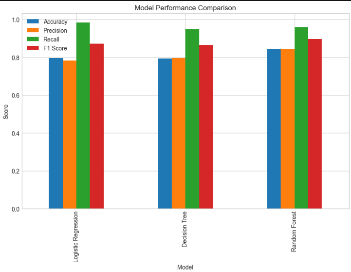
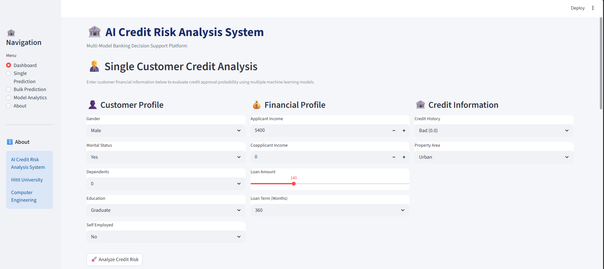
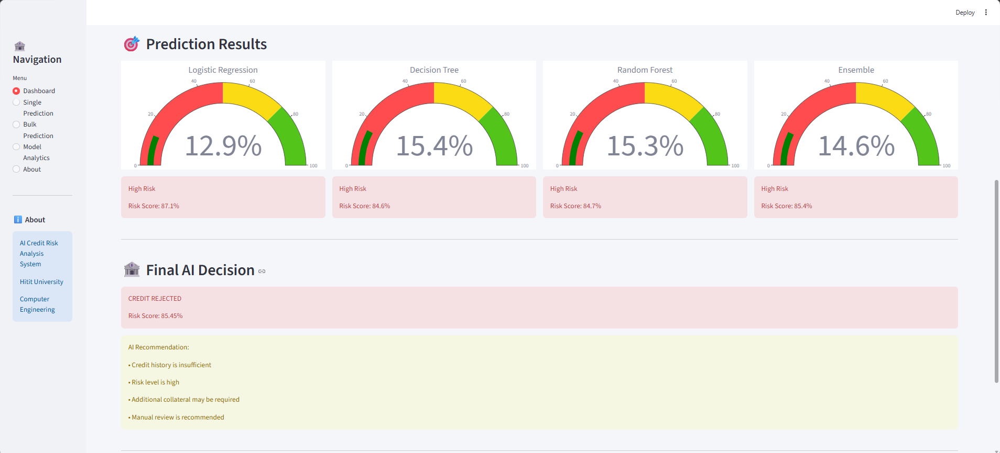
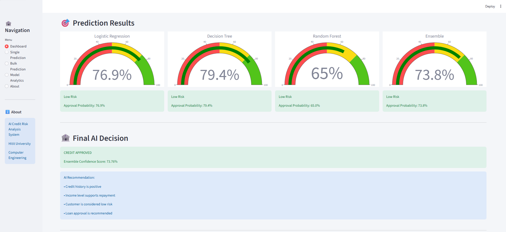

# AI-Based Loan Approval and Credit Risk Analysis System

This project uses machine learning to predict whether a customer's loan application will be approved.

## Project Scope

- Data Preprocessing
- Exploratory Data Analysis (EDA)
- Classification Models (Logistic Regression, Decision Tree, Random Forest)
- Cross Validation
- Performance Metrics (Accuracy, Precision, Recall, F1)
- Confusion Matrix
- ROC Curve & AUC
- Model Comparison
- Explainable AI (Feature Importance, LIME)
- Streamlit Web Application

## Dataset

The dataset contains demographic and financial information about loan applicants (gender, marital status, education, income, loan amount, credit history, etc.). The target variable is `Loan_Status` (loan approval status), with 3000 application records.

## Models Used

| Model | Description |
|---|---|
| Logistic Regression | Trained on scaled data |
| Decision Tree | Trained on raw data |
| Random Forest | Trained on raw data |

## Model Comparison

The Accuracy, Precision, Recall, and F1 Score metrics of the three models are compared below.



## Streamlit Application

An interactive credit risk analysis interface was built using the trained models. Users can enter customer information and instantly view the approval probability from all three models along with the ensemble prediction.







### Running the App

```bash
pip install -r requirements.txt
streamlit run app/app.py
```

## Project Structure

```
├── data/
│   └── loan_data.csv
├── models/
│   ├── logistic_regression_model.pkl
│   ├── decision_tree_model.pkl
│   ├── random_forest_model.pkl
│   ├── scaler.pkl
│   └── encoders.pkl
├── notebooks/
│   └── loan_prediction_analysis.ipynb
├── images/
│   ├── model_comparison.png
│   ├── streamlit_app.png
│   └── streamlit_result.png
├── app/
        app.py
└── README.md
```

## Developer
Erbol Zhanyshov ---

Mert Laleli ---

*** Hitit University - Computer Engineering ***
